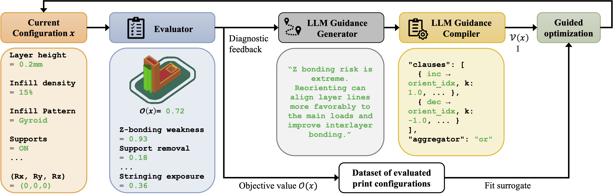

# LLM-Guided Print Configuration Optimization

Code for the paper "Programming Manufacturing Robots with Imperfect AI: LLMs as Tuning Experts for FDM Print Configuration Selection". 

Given part geometry and user objectives (e.g., prioritizing quality over time and cost), we cast print configuration selection as a diagnosis-driven optimization problem. In each iteration, a candidate configuration is evaluated to produce a scalar objective and diagnostics on printability and quality issues. An LLM prioritizes what issue to address next and proposes parameter-level changes. These proposals are converted into guidance for generating the next configuration in two forms: soft guidance that biases generation toward configurations consistent with the proposed changes and hard constraints that restrict the next step to modifying only the implicated parameters while keeping others fixed. The process repeats under this combined soft-guidance and hard-constraint scheme. The following subsections describe each module, and the following figure summarizes the overall approach.



## Quick start

### 0) Setup
Export your key:
```bash
export OPENAI_API_KEY="sk-proj-..."
```

## Workflow

### 1) Generate orientation tables
Create the orientation lookup used by the evaluator/optimizer:
```bash
python3 generating_unique_orientations.py
```

This produces an `orientations.npz` file (or similarly named `.npz`) that the optimization script loads via `--orientation_tables` (or its default).

---

### 2) Compute time/cost reference values for the dataset
Compute and store reference time/cost values (`refs_store.json`) for **all objects** in the dataset directory:

```bash
python3 driver_reference_computation.py
```

What this does:
- Iterates through objects in the dataset directory
- Creates a per-object folder like `logs_<objectname>/`
- Runs the **print configuration evaluator**, which calls the slicer/toolpath generator to obtain:
  - estimated print time
  - estimated filament cost
- Saves the reference store (e.g., `refs_store.json`) in the per-object logs folder

---

### 3) Run Bayesian optimization with LLM guidance
Run the optimization loop for a specific object:

```bash
python3 gpt_guided_optimization.py \
  --model_stl ./dataset/model/bracket.stl \
  --profile_ini ./dataset/config/bracket.ini \
  --refs_store ./logs_dataset/logs_bracket/refs_store.json \
  --require_refs \
  --load_bearing \
  --load_direction xz \
  --output_root_dir ./logs_dataset/logs_bracket/gpt_guidance \
  --use_dynamic_llm_cache \
  --live_llm_backend openai \
  --live_llm_model gpt-5.2 \
  --live_llm_reasoning_effort medium \
  --openai_api_key "$OPENAI_API_KEY"
```

#### Prompts and the LLM modules
- `system_msg_fewshot.txt` is the system prompt for the LLM guidance generator.
- The user prompt for the generator is built on-the-fly from the evaluator’s structured diagnostics.
- `gpt_guidance_compiler.py` implements the LLM guidance compiler:
  - It compiles the generator’s selected action into a JSON object.
  - The optimizer then uses this guidance as:
    - soft guidance (biasing the acquisition function)
    - hard constraints (freezing parameters not implicated by the chosen action)

## Notes
- If `--use_dynamic_llm_cache` is enabled, the action-selection decisions can be cached to avoid repeated calls for identical diagnostic signatures.
- References (`--refs_store`) are required when running with `--require_refs`. Ensure Step 2 has been run for the object first.
